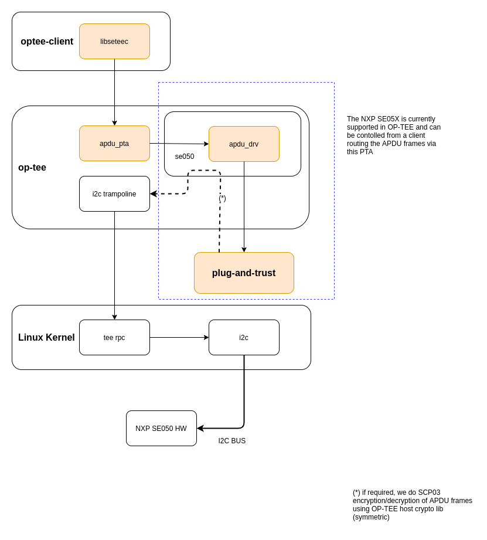

.. _cryptographic_implementation:

############################
Cryptographic implementation
############################
This document describes how the TEE Cryptographic Operations API is implemented,
how the default crypto provider may be configured at compile time, and how it
may be replaced by another implementation.

Overview
********
There are several layers from the Trusted Application to the actual crypto
algorithms. Most of the crypto code runs in kernel mode inside the TEE core.
Here is a schematic view of a typical call to the crypto API. The numbers in
square brackets ([1], [2]...) refer to the sections below.

.. code-block:: none

    -   some_function()                             (Trusted App) -
    [1]   TEE_*()                      User space   (libutee.a)
    ------- utee_*() ----------------------------------------------
    [2]       tee_svc_*()              Kernel space
    [3]         crypto_*()                          (libtomcrypt.a and crypto.c)
    [4]           /* LibTomCrypt */                 (libtomcrypt.a)

[1] The TEE Cryptographic Operations API
****************************************
OP-TEE implements the Cryptographic Operations API defined by the GlobalPlatform
association in the :ref:`tee_internal_core_api`. This includes cryptographic
functions that span various cryptographic needs: message digests, symmetric
ciphers, message authentication codes (MAC), authenticated encryption,
asymmetric operations (encryption/decryption or signing/verifying), key
derivation, and random data generation. These functions make up the TEE
Cryptographic Operations API.

The Internal API is implemented in tee_api_operations.c_, which is compiled into
a static library: ``${O}/ta_arm{32,64}-lib/libutee/libutee.a``.

Most API functions perform some parameter checking and manipulations, then
invoke some *utee\_\** function to switch to kernel mode and perform the
low-level work.

The *utee\_\** functions are declared in utee_syscalls.h_ and implemented in
utee_syscalls_asm.S_ They are simple system call wrappers which use the *SVC*
instruction to switch to the appropriate system service in the OP-TEE kernel.

[2] The crypto services
***********************
All cryptography-related system calls are declared in tee_svc_cryp.h_ and
implemented in tee_svc_cryp.c_. In addition to dealing with the usual work
required at the user/kernel interface (checking parameters and copying memory
buffers between user and kernel space), the system calls invoke a private
abstraction layer: the **Crypto API**, which is declared in crypto.h_. It serves
two main purposes:

    1. Allow for alternative implementations, such as hardware-accelerated
       versions.

    2. Provide an easy way to disable some families of algorithms at
       compile-time to save space. See sw_crypto_lib_ below.

[3] crypto_*()
**************
The ``crypto_*()`` functions implement the actual algorithms and helper
functions. TEE Core has one global active implementation of this interface. The
default implementation, mostly based on LibTomCrypt_, is as follows:

.. code-block:: c
    :caption: File: core/crypto/crypto.c

    /*
     * Default implementation for all functions in crypto.h
     */

    #if !defined(_CFG_CRYPTO_WITH_HASH)
    TEE_Result crypto_hash_get_ctx_size(uint32_t algo __unused,
                                        size_t *size __unused)
    {
            return TEE_ERROR_NOT_IMPLEMENTED;
    }
    ...
    #endif /*_CFG_CRYPTO_WITH_HASH*/

.. code-block:: c
    :caption: File: core/lib/libtomcrypt/tee_ltc_provider.c

    #if defined(_CFG_CRYPTO_WITH_HASH)
    TEE_Result crypto_hash_get_ctx_size(uint32_t algo, size_t *size)
    {
    	/* ... */
    	return TEE_SUCCESS;
    }

    #endif /*_CFG_CRYPTO_WITH_HASH*/

As shown above, families of algorithms can be disabled and crypto.c_ will
provide default null implementations that will return
``TEE_ERROR_NOT_IMPLEMENTED``.

Public/private key format
*************************
crypto.h_ uses implementation-specific types to hold key data for asymmetric
algorithms. For instance, here is how a public RSA key is represented:

.. code-block:: c
    :caption: File: core/include/crypto/crypto.h

    struct rsa_public_key {
        struct bignum *e;	/* Public exponent */
        struct bignum *n;	/* Modulus */
    };

This is also how such keys are stored inside the TEE object attributes
(``TEE_ATTR_RSA_PUBLIC_KEY`` in this case). ``struct bignum`` is an opaque type,
known to the underlying implementation only. ``struct bignum_ops`` provides
functions so that the system services can manipulate data of this type. This
includes allocation/deallocation, copy, and conversion to or from the big endian
binary format.

.. code-block:: c
    :caption: File: core/include/crypto/crypto.h

    struct bignum *crypto_bignum_allocate(size_t size_bits);

    TEE_Result crypto_bignum_bin2bn(const uint8_t *from, size_t fromsize,
                    struct bignum *to);

    void crypto_bignum_bn2bin(const struct bignum *from, uint8_t *to);
    /*...*/

.. _sw_crypto_lib:

[4] Software crypto library
***************************

LibTomCrypt is the default software implementation for cryptographic
operations. When so, this is stated by OP-TEE configuration directives
``CFG_CRYPTOLIB_NAME=tomcrypt`` and
``CFG_CRYPTOLIB_DIR=core/lib/libtomcrypt``.

Mbed TLS can be embedded in OP-TEE core as a software cryptographic library
alternative to LibTomCrypt. See :ref:`libmbedtls`.

Some algorithms may be disabled at compile time if they are not needed, in order
to reduce the size of the OP-TEE image and reduces its memory usage. This is
done by setting the appropriate configuration variable. For example:

.. code-block:: bash

    $ make CFG_CRYPTO_AES=n              # disable AES only
    $ make CFG_CRYPTO_{AES,DES}=n        # disable symmetric ciphers
    $ make CFG_CRYPTO_{DSA,RSA,DH,ECC}=n # disable public key algorithms
    $ make CFG_CRYPTO=n                  # disable all algorithms

Please refer to `core/crypto.mk` for the list of all supported
variables.

Note that the application interface is **not** modified when algorithms are
disabled. This means, for instance, that the functions ``TEE_CipherInit()``,
``TEE_CipherUpdate()`` and ``TEE_CipherFinal()`` would remain present in
``libutee.a`` even if all symmetric ciphers are disabled (they would simply
return ``TEE_ERROR_NOT_IMPLEMENTED``).

Add a new software based crypto implementation
**********************************************
To add a new software based implementation, the default one in
`core/lib/libtomcrypt`_ in combination with what is in `core/crypto`_ should be
used as a reference. Here are the main things to consider when adding a new
crypto provider:

    - Put all the new code in its own directory under ``core/lib`` unless it is
      code that will be used regardless of which crypto provider is in use. How
      we are dealing with AES-GCM in `core/crypto`_ could serve as an example.

    - Avoid modifying tee_svc_cryp.c_. It should not be needed.

    - Although not all crypto families need to be defined, all are required for
      compliance to the GlobalPlatform specification.

    - If you intend to make some algorithms optional, please try to re-use the
      same names for configuration variables as the default implementation.

[5] Support for crypto IC
*************************
Some cryptographic co-processors and secure elements are supported under a
Generic Cryptographic Driver interface, connecting the TEE Crypto generic APIs
to the HW driver interface. This interface is in
`core/drivers/crypto/crypto_api`_ and should be followed when adding support for
new devices.

At the time of writing, OP-TEE does not support the `GP TEE Secure Element API`_
and therefore the access to the secure element - the NXP EdgeLock® SE05x -
follows the Cryptographic Operations API presenting a single session to the
device. This session is shared with the normal world through the PKCS#11
interface but also through a more generic interface (`libseetec`_) which allows
clients to send Application Protocol Data Units (APDUs) directly to the device.

Notice that cryptographic co-processors do not necessarily comply with all the
GP requirements tested and covered by the OP-TEE sanity test suite
(`optee_test`_). In those cases where the cryptographic operations are not
supported - i.e: the SE05x does not implement all RSA key sizes - we opted for
disabling those particular tests at build time rather than letting them fail.

Some cryptographic co-processors may have limitations regarding the
range of key sizes and supported ciphers. For instance, the AMD/Xilinx
Versal ACAP Cryptographic driver may have constraints on key sizes,
while NXP SE5X HSM modules may lack support for RSA or ECC. In such
cases, especially when dealing with unsupported key sizes, it may be
necessary to resort to a software implementation of the cipher,
typically utilizing LibTomCrypt.

.. note::
    While the Hardware Security Modules or Cryptographic hardware
    processors supported by OP-TEE may achieve FIPS 140-2 certification
    at level 3, the software implementations of certain algorithms that
    OP-TEE may fallback to cannot attain certification beyond level 2.

NXP SE05X Family of Secure Elements
***********************************

This family of I2C bus devices are supported through the se050 cryptographic driver
located at `core/drivers/crypto/se050`_. Before the REE boots, the session with
the device is established using one of the OP-TEE supported I2C platform device
drivers. Once the REE is up, the cryptographic driver can be configured to use
the I2C driver in the REE (via RPC service) or continue using the one in OP-TEE.

Unless the Secure Element owns the I2C bus (no other elements on the bus, no
runtime-PM and so forth), it is recommended to route all traffic via the Normal
World. Initial communication with the device is not data intensive and therefore
slow I2C drivers - perhaps those not using DMA channels - do not represent much
of a performance drag; the situation changes once clients start hammering the
device.

If using the REE for I2C transfers, it is also **imperative** to configure the
driver so that the `GP Secure Channel Protocol 03`_ is enabled prior to exiting the
Secure World; this way all communication between the processor and the secure
element is encrypted and MAC authenticated. Please check the usage of the
``CFG_CORE_SE05X_SCP03_EARLY`` configuration option.

Aside of the secure element integration as an OP-TEE cryptographic driver,
OP-TEE  also presents an Application Protocol Data Units (APDU) interface to
users via its  OP-TEE client.

    Access to the Secure Element from libseetec and the APDU PTA.

Using this interface, priviledged applications can control the Secure Element to
inject or delete keys or certificates, encrypt, decrypt, sign and verify data
and so forth. An application implementing a subset of those functions can be
seen in this Foundries.io repository: `fio-se05x-cli`_

This reference code is not fully functional in mainline as it's not yet possible
to import keys and certificates from the Secure Element into OP-TEE's PKCS#11
implementation. However, a user could still clear the Secure Element NVM memory
and read certificates stored in it.

.. Source files
.. _core/crypto: https://github.com/OP-TEE/optee_os/blob/master/core/crypto
.. _core/drivers/crypto/crypto_api: https://github.com/OP-TEE/optee_os/blob/master/core/drivers/crypto/crypto_api
.. _core/drivers/crypto/se050: https://github.com/OP-TEE/optee_os/blob/master/core/drivers/crypto/se050
.. _crypto.c: https://github.com/OP-TEE/optee_os/blob/master/core/crypto/crypto.c
.. _crypto.h: https://github.com/OP-TEE/optee_os/blob/master/core/include/crypto/crypto.h
.. _core/lib/libtomcrypt: https://github.com/OP-TEE/optee_os/blob/master/core/lib/libtomcrypt
.. _core/lib/libtomcrypt/sub.mk: https://github.com/OP-TEE/optee_os/blob/master/core/lib/libtomcrypt/sub.mk
.. _libseetec: https://github.com/OP-TEE/optee_client/commit/f4f54e5a76641fda22a49f00294771f948cd4c92
.. _optee_test: https://github.com/OP-TEE/optee_test
.. _tee_api_operations.c: https://github.com/OP-TEE/optee_os/blob/master/lib/libutee/tee_api_operations.c
.. _tee_svc_cryp.c: https://github.com/OP-TEE/optee_os/blob/master/core/tee/tee_svc_cryp.c
.. _tee_svc_cryp.h: https://github.com/OP-TEE/optee_os/blob/master/core/include/tee/tee_svc_cryp.h
.. _utee_syscalls.h: https://github.com/OP-TEE/optee_os/blob/master/lib/libutee/include/utee_syscalls.h
.. _utee_syscalls_asm.S: https://github.com/OP-TEE/optee_os/blob/master/lib/libutee/arch/arm/utee_syscalls_asm.S

.. Other links:
.. _fio-se05x-cli: https://github.com/foundriesio/fio-se05x-cli
.. _LibTomCrypt: https://github.com/libtom/libtomcrypt
.. _GP TEE Secure Element API: https://globalplatform.org/specs-library/tee-secure-element-api/
.. _GP Secure Channel Protocol 03: https://globalplatform.org/wp-content/uploads/2019/03/GPC_2.2_D_SCP03_v1.0.pdf
