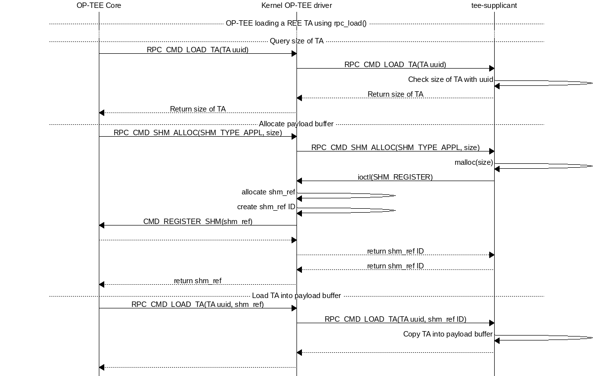
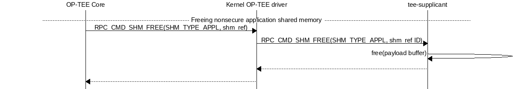
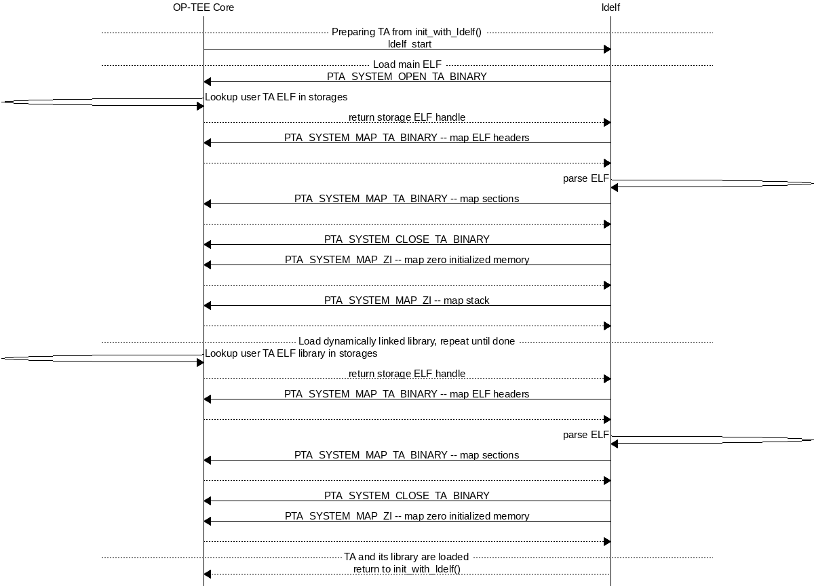
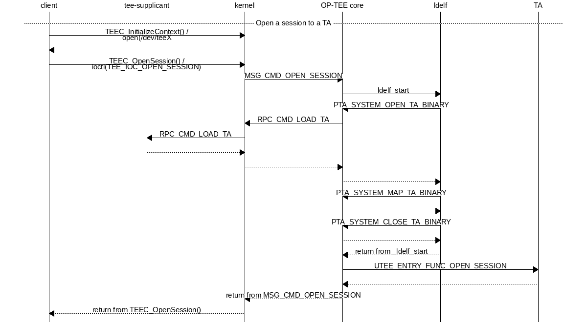

.. _trusted_applications:

####################
Trusted Applications
####################
There are two ways to implement Trusted Applications (TAs), Pseudo TAs and user
mode TAs. User mode TAs are full featured Trusted Applications as specified by
the :ref:`globalplatform_api` TEE specifications, these are simply the ones
people are referring to when they are saying "Trusted Applications" and in most
cases this is the preferred type of TA to write and use.

.. _pta:

Pseudo Trusted Applications
***************************
A Pseudo Trusted Application is not a Trusted Application. A Pseudo TA is not a
specific entity. A Pseudo TA is an interface. It is an interface exposed by the
OP-TEE Core to its outer world: to secure client Trusted Applications and to
non-secure client entities.

These are implemented directly to the OP-TEE core tree in, e.g.,
``core/pta`` and are built along with and statically built into the
OP-TEE core blob.

The Pseudo Trusted Applications included in OP-TEE already are OP-TEE secure
privileged level services hidden behind a "GlobalPlatform TA Client" API. These
Pseudo TAs are used for various purposes such as specific secure services or
embedded tests services.

Pseudo TAs **do not** benefit from the GlobalPlatform Core Internal API support
specified by the GlobalPlatform TEE specs. These APIs are provided to TAs as a
static library each TA shall link against (the ":ref:`libutee`") and that calls
OP-TEE core service through system calls. As OP-TEE core does not link with
:ref:`libutee`, Pseudo TAs can **only** use the OP-TEE core internal APIs and
routines.

As Pseudo TAs runs at the same privileged execution level as the OP-TEE core
code itself and that might or might not be desirable depending on the use case.

In most cases an unprivileged (user mode) TA is the best choice instead of
adding your code directly to the OP-TEE core. However if you decide your
application is best handled directly in OP-TEE core like this, you can look at
``core/pta/stats.c`` as a template and just add your Pseudo TA based on
that to the ``sub.mk`` in the same directory.

.. _user_mode_ta:

User Mode Trusted Applications
******************************
User Mode Trusted Applications are loaded (mapped into memory) by OP-TEE core in
the Secure World when something in Rich Execution Environment (REE) wants to
talk to that particular application UUID. They run at a lower CPU privilege
level than OP-TEE core code. In that respect, they are quite similar to regular
applications running in the REE, except that they execute in Secure World.

Trusted Application benefit from the GlobalPlatform :ref:`tee_internal_core_api`
as specified by the GlobalPlatform TEE specifications. There are several types
of user mode TAs, which differ by the way they are stored.

.. _ta_locations:

TA locations
************
Plain TAs (user mode) can reside and be loaded from various places. There are
three ways currently supported in OP-TEE.

.. _early_ta:

Early TA
========
The so-called early TAs are virtually identical to the REE FS TAs, but instead
of being loaded from the Normal World file system, they are linked into a
special data section in the TEE core blob. Therefore, they are available even
before ``tee-supplicant`` and the REE's filesystems have come up. Please find
more details in the `early TA commit`_.

.. _ree_fs_ta:

REE filesystem TA
=================
They consist of a ELF_ file, signed and optionally encrypted, named from the
UUID of the TA and the suffix ``.ta``. They are built separately from the
OP-TEE core boot-time blob, although when they are built they use the same
build system, and are signed with the key from the build of the original OP-TEE
core blob.

Because the TAs are signed and optionally encrypted with
``scripts/sign_encrypt.py``, they are able to be stored in the untrusted REE
filesystem, and ``tee-supplicant`` will take care of passing them to be checked
and loaded by the Secure World OP-TEE core.

REE-FS TA rollback protection
-----------------------------
OP-TEE core maintains a ``ta_ver.db`` file in secure storage to check for
version of REE TAs as they are loaded from REE-FS in order to prevent against
any TA version downgrades. TA version can be configured via TA build option:
``CFG_TA_VERSION=<unsigned integer>``.

Note: Here rollback protection is effective only when ``CFG_RPMB_FS=y``.

REE-FS TA formats
-----------------
REE filesystem TAs come in three formats:

    1. Legacy TAs signed, not encrypted, cannot be created anymore by the build
       scripts since version 3.7.0.

    2. Bootstrap TAs, signed with the key from the build of the original OP-TEE
       core blob, not encrypted.

    3. Encrypted TAs, sign-then-encrypt-then-MAC, encrypted with ``TA_ENC_KEY``
       when ``CFG_ENCRYPT_TA=y``. During OP-TEE runtime, the symmetric key used
       to decrypt TA has to be provided in a platform specific manner via
       overriding API:

    .. code-block:: c

        TEE_Result tee_otp_get_ta_enc_key(uint32_t key_type, uint8_t *buffer,
                                          size_t len);

REE-FS TA header structure
--------------------------
All REE filesystems TAs has common header, ``struct shdr``, defined as:

.. code-block:: c

    enum shdr_img_type {
            SHDR_TA = 0,
            SHDR_BOOTSTRAP_TA = 1,
            SHDR_ENCRYPTED_TA = 2,
    };

    #define SHDR_MAGIC      0x4f545348

    /**
     * struct shdr - signed header
     * @magic:      magic number must match SHDR_MAGIC
     * @img_type:   image type, values defined by enum shdr_img_type
     * @img_size:   image size in bytes
     * @algo:       algorithm, defined by public key algorithms TEE_ALG_*
     *              from TEE Internal API specification
     * @hash_size:  size of the signed hash
     * @sig_size:   size of the signature
     * @hash:       hash of an image
     * @sig:        signature of @hash
     */
    struct shdr {
            uint32_t magic;
            uint32_t img_type;
            uint32_t img_size;
            uint32_t algo;
            uint16_t hash_size;
            uint16_t sig_size;
            /*
             * Commented out element used to visualize the layout dynamic part
             * of the struct.
             *
             * hash is accessed through the macro SHDR_GET_HASH and
             * signature is accessed through the macro SHDR_GET_SIG
             *
             * uint8_t hash[hash_size];
             * uint8_t sig[sig_size];
             */
    };

    #define SHDR_GET_SIZE(x)        (sizeof(struct shdr) + (x)->hash_size + \
                                     (x)->sig_size)
    #define SHDR_GET_HASH(x)        (uint8_t *)(((struct shdr *)(x)) + 1)
    #define SHDR_GET_SIG(x)         (SHDR_GET_HASH(x) + (x)->hash_size)

The field ``img_type`` tells the type of TA, if it's ``SHDR_TA`` (0),
it's a legacy TA. If it's ``SHDR_BOOTSTRAP_TA`` (1) it's a bootstrap TA.

The field ``algo`` tells the algorithm used. The script used to sign TAs
currently uses ``TEE_ALG_RSASSA_PKCS1_V1_5_SHA256`` (0x70004830). This
means RSA with PKCS#1v1.5 padding and SHA-256 hash function. OP-TEE accepts
any of the ``TEE_ALG_RSASSA_PKCS1_*`` algorithms.

For bootstrap TAs ``struct shdr`` is followed by a subheader, ``struct
shdr_bootstrap_ta`` which is defined as:

.. code-block:: c

    /**
     * struct shdr_bootstrap_ta - bootstrap TA subheader
     * @uuid:       UUID of the TA
     * @ta_version: Version of the TA
     */
    struct shdr_bootstrap_ta {
            uint8_t uuid[sizeof(TEE_UUID)];
            uint32_t ta_version;
    };

The fields ``uuid`` and ``ta_version`` allows extra checks to be performed
when loading the TA. Currently only the ``uuid`` field is checked.

For encrypted TAs ``struct shdr`` is followed by a subheader, ``struct
shdr_bootstrap_ta`` which is followed by another subheader, ``struct
shdr_encrypted_ta`` defined as:

.. code-block:: c

    /**
     * struct shdr_encrypted_ta - encrypted TA header
     * @enc_algo:   authenticated encyption algorithm, defined by symmetric key
     *              algorithms TEE_ALG_* from TEE Internal API
     *              specification
     * @flags:      authenticated encyption flags
     * @iv_size:    size of the initialization vector
     * @tag_size:   size of the authentication tag
     * @iv:         initialization vector
     * @tag:        authentication tag
     */
    struct shdr_encrypted_ta {
            uint32_t enc_algo;
            uint32_t flags;
            uint16_t iv_size;
            uint16_t tag_size;
            /*
             * Commented out element used to visualize the layout dynamic part
             * of the struct.
             *
             * iv is accessed through the macro SHDR_ENC_GET_IV and
             * tag is accessed through the macro SHDR_ENC_GET_TAG
             *
             * uint8_t iv[iv_size];
             * uint8_t tag[tag_size];
             */
    };

The field ``enc_algo`` tells the algorithm used. The script used to encrypt
TAs currently uses ``TEE_ALG_AES_GCM`` (0x40000810). OP-TEE core also accepts
``TEE_ALG_AES_CCM`` algorithm.

The field ``flags`` supports a single flag to tell encryption key type which
is defined as:

.. code-block:: c

    #define SHDR_ENC_KEY_TYPE_MASK  0x1

    enum shdr_enc_key_type {
            SHDR_ENC_KEY_DEV_SPECIFIC = 0,
            SHDR_ENC_KEY_CLASS_WIDE = 1,
    };

REE-FS TA binary formats
------------------------
TA binary follows the ELF file which normally is stripped as additional
symbols etc will be ignored when loading the TA.

Legacy TA binary is formatted as:

.. code-block:: none

    hash = H(<struct shdr> || <stripped ELF>)
    signature = RSA-Sign(hash)
    legacy_binary = <struct shdr> || <hash> || <signature> || <stripped ELF>

Bootstrap TA binary is formatted as:

.. code-block:: none

    hash = H(<struct shdr> || <struct shdr_bootstrap_ta> || <stripped ELF>)
    signature = RSA-Sign(<hash>)
    bootstrap_binary = <struct shdr> || <hash> || <signature> ||
                       <struct shdr_bootstrap_ta> || <stripped ELF>

Encrypted TA binary is formatted as:

.. code-block:: none

    nonce = <unique random value>
    ciphertext, tag = AES_GCM(<stripped ELF>)
    hash = H(<struct shdr> || <struct shdr_bootstrap_ta> ||
             <struct shdr_encrypted_ta> || <nonce> || <tag> || <stripped ELF>)
    signature = RSA-Sign(<hash>)
    encrypted_binary = <struct shdr> || <hash> || <signature> ||
                       <struct shdr_bootstrap_ta> ||
                       <struct shdr_encrypted_ta> || <nonce> || <tag> ||
                       <ciphertext>

Verifying with Subkeys
----------------------
A TA can be verified using a subkey or a chain of subkeys. This allows
delegation of TA signing without distributing the root key. TAs signed with
a subkey are confined to the UUID-V5 namespace of the subkey to avoid TA
UUID clashes with different subkeys.

SHDR_SUBKEY is a type of header which enables chains of public keys.  The
public root key is used to verify the first public subkey, which then is
used to verify the next public subkey and so on.

The TA is finally verified using the last subkey. All these headers are
added in front of the TA binary so everything needed to verify the TA is
available when it's loaded into memory.

For details on subkeys see also :ref:`subkeys`

Loading REE-FS TA
-----------------
A REE TA is loaded into shared memory using a series or RPC in
:ref:`load_ree_ta`. The payload memory is allocated via TEE-supplicant and
later freed when the TA has been loaded into secure memory in
:ref:`free_appl_shm`.

.. _load_ree_ta:

    Loading a REE TA into nonsecure shared memory

.. _free_appl_shm:

    Freeing previously allocated nonsecure shared memory

.. _secure_storage_ta:

Secure Storage TA
=================
These are stored in secure storage. The meta data is stored in a database of all
installed TAs and the actual binary is stored encrypted and integrity protected
as a separate file in the untrusted REE filesystem (flash). Before these TAs can
be loaded they have to be installed first, this is something that can be done
during initial deployment or at a later stage.

For test purposes the test program xtest can install a TA into secure storage
with the command:

.. code-block:: bash

    $ xtest --install-ta

TAs stored in secure storage are kept in a TA database. The TA database
consists of a single file with the name ``dirf.db`` which is stored either
in the REE filesystem based secure storage or in RPMB. The file is
encrypted and integrity protected as any other object in secure storage.
The TAs themselves are not stored in ``dirf.db``, they are instead stored
in the REE filesystem encrypted and integrity protected. One reason for
this is that TAs can potentially be quite large, several megabytes, while
secure storage is designed to hold only small objects counted in kilobytes.

``dirf.db`` constsist of an array of ``struct tadb_entry``, defined as:

.. code-block:: C

    /*
     * struct tee_tadb_property
     * @uuid:       UUID of Trusted Application (TA) or Security Domain (SD)
     * @version:    Version of TA or SD
     * @custom_size:Size of customized properties, prepended to the encrypted
     *              TA binary
     * @bin_size:   Size of the binary TA
     */
    struct tee_tadb_property {
            TEE_UUID uuid;
            uint32_t version;
            uint32_t custom_size;
            uint32_t bin_size;
    };

    #define TADB_IV_SIZE            TEE_AES_BLOCK_SIZE
    #define TADB_TAG_SIZE           TEE_AES_BLOCK_SIZE
    #define TADB_KEY_SIZE           TEE_AES_MAX_KEY_SIZE

    /*
     * struct tadb_entry - TA database entry
     * @prop:        properties of TA
     * @file_number: encrypted TA is stored in <file_number>.ta
     * @iv:          Initialization vector of the authentication crypto
     * @tag:         Tag used to validate the authentication encrypted TA
     * @key:         Key used to decrypt the TA
     */
    struct tadb_entry {
            struct tee_tadb_property prop;
            uint32_t file_number;
            uint8_t iv[TADB_IV_SIZE];
            uint8_t tag[TADB_TAG_SIZE];
            uint8_t key[TADB_KEY_SIZE];
    };

Entries where the ``UUID`` consists of zeros only are not valid and are
ignored. The ``file_number`` field represents that name of the file stored
in the REE filesystem. The filename is made from the decimal string
representation of ``file_number`` with ``.ta`` appended, or if it was to be
printed: ``printf("%u.ta", file_number)``.

The TA is decrypted using the authentication encryption algorithm AES-GCM
initialized with the ``iv`` and ``key`` fields, the ``tag`` field is used
when finalizing the decryption

A TA is looked up in the TA database by opening ``dirf.db`` and scanning
through the elements which are of type ``struct tadb_entry`` until a
matching UUID is found.

Loading and preparing TA for execution
**************************************

User mode TAs are loaded into final memory in the same way using the user
mode ELF loader ``ldelf``. The different TA locations has a common
interface towards ``ldelf`` which makes the user mode operations identical
regarless of how the TA is stored.

The TA is loaded into secure memory in :ref:`prepare_ta`.

.. _prepare_ta:

    Preparing TA for execution

After ``ldelf`` has returned with a TA prepared for execution it still
remains in memory to serve the TA if dlopen() and friends are used.
``ldelf`` is also used to dump stack trace and detailed memory mappings if
a TA is terminated via an abort.

A high level view of the entire flow from the client application in Linux
user space where a session is opened to a TA is given in
:ref:`open_session`.

.. _open_session:

    Open session to a TA

.. _ta_properties:

TA Properties
*************
This section give a more in depth description of the TA properties (see
:ref:`build_trusted_applications` also).

GlobalPlatform Properties
=========================
Standard TA properties must be defined through property flag in macro
``TA_FLAGS`` in ``user_ta_header_defines.h``

Single Instance
---------------
``"gpd.ta.singleInstance"`` is a boolean property of the TA. This property
defines if one instance of the TA must be created and will receive all open
session request, or if a new specific TA instance must be created for each
incoming open session request. OP-TEE TA flag ``TA_FLAG_SINGLE_INSTANCE`` sets
to configuration of this property. The boolean property is set to ``true`` if
``TA_FLAGS`` sets bit ``TA_FLAG_SINGLE_INSTANCE``, otherwise the boolean
property is set to ``false``.

Multi-session
-------------
``"gpd.ta.multiSession"`` is a boolean property of the TA. This property defines
if the TA instance can handle several sessions. If disabled, TA instance support
only one session. In such case, if the TA already has a opened session, any open
session request will return with a busy error status.

.. note::

    This property is **meaningless** if TA is **NOT** SingleInstance TA.

OP-TEE TA flag ``TA_FLAG_MULTI_SESSION`` sets to configuration of this property.
The boolean property is set to ``true`` if ``TA_FLAGS`` sets bit
``TA_FLAG_MULTI_SESSION``, otherwise the boolean property is set to ``false``.

Keep Alive
----------
``"gpd.ta.instanceKeepAlive"`` is a boolean property of the TA. This property
defines if the TA instance created must be destroyed or not when all sessions
opened towards the TA are closed. If the property is enabled, TA instance, once
created (at 1st open session request), is never removed unless the TEE itself is
restarted (boot/reboot).

.. note::

    This property is **meaningless** if TA is **NOT** SingleInstance TA.

OP-TEE TA flag ``TA_FLAG_INSTANCE_KEEP_ALIVE`` sets to configuration of this
property. The boolean property is set to ``true`` if ``TA_FLAGS`` sets bit
``TA_FLAG_INSTANCE_KEEP_ALIVE``, otherwise the boolean property is set to
``false``.

Heap Size
---------
``"gpd.ta.dataSize"`` is a 32bit integer property of the TA. This property
defines the size in bytes of the TA allocation pool, in which ``TEE_Malloc()``
and friends allocate memory. The value of the property must be defined by the
macro ``TA_DATA_SIZE`` in ``user_ta_header_defines.h`` (see
:ref:`build_ta_properties`).

Stack Size
----------
``"gpd.ta.stackSize"`` is a 32bit integer property of the TA. This property
defines the size in bytes of the stack used for TA execution. The value of the
property must be defined by the macro ``TA_STACK_SIZE`` in
``user_ta_header_defines.h`` (see :ref:`build_ta_properties`).

Property Extensions
===================

Secure Data Path Flag
---------------------
``TA_FLAG_SECURE_DATA_PATH`` is a bit flag supported by ``TA_FLAGS``. This
property flag claims the secure data support from the OP-TEE OS for the TA.
Refer to the OP-TEE OS for secure data path support. TAs that do not set
``TA_FLAG_SECURE_DATA_PATH`` in the value of ``TA_FLAGS`` will **not** be able
to handle memory reference invocation parameters that relate to secure data path
buffers.

.. _ta_property_cache_maintenance:

Cache maintenance Flag
----------------------
``TA_FLAG_CACHE_MAINTENANCE`` is a bit flag supported by ``TA_FLAGS``. This
property flag, when enabled, allows Trusted Applciation to use the cache
maintenance API extension of the Internal Core API described in
:ref:`extensions_cache_maintenance`. TAs that do not set
``TA_FLAG_CACHE_MAINTENANCE`` in the value of their ``TA_FLAGS`` will not be
able to call the cache maintenance API.

Deprecated Property Flags
-------------------------
Older versions of OP-TEE used to define extended property flags that are
deprecated and meaningless to current OP-TEE. These are ``TA_FLAG_USER_MODE``,
``TA_FLAG_EXEC_DDR`` and ``TA_FLAG_REMAP_SUPPORT``.

.. _ELF: https://en.wikipedia.org/wiki/Executable_and_Linkable_Format
.. _early TA commit: https://github.com/OP-TEE/optee_os/commit/d0c636148b3a
